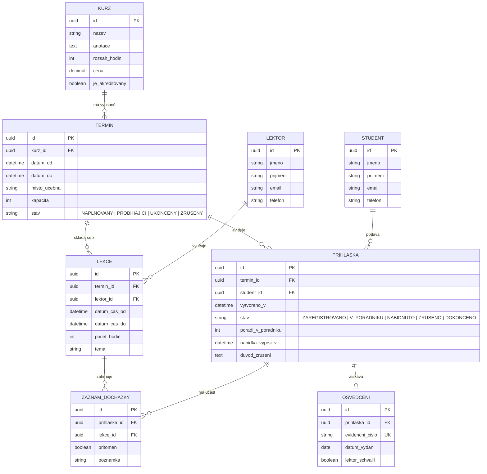

# Akademie Trutnov – Kurzy vzdělávacího centra (Zadání C)

> **Semestrální projekt předmětu Pokročilé programování (PPRO)**  
> Fakulta informatiky a managementu, Univerzita Hradec Králové (ZS 2026/2027)  
> **Klient:** Ing. Lucie Bartošová, Akademie Trutnov  
> **Jediný zdroj pravdy (Single Source of Truth):** Tento dokument slouží jako centrální technická a byznysová dokumentace projektu.

---

## Obsah
1. [Profil klienta a kontext](#1-profil-klienta-a-kontext)
2. [Požadavky klienta (Co klient chce)](#2-požadavky-klienta-co-klient-chce)
3. [Obchodní pravidla (Na čem klient trvá)](#3-obchodní-pravidla-na-čem-klient-trvá)
4. [Přání a nálady (Co klient prohodil mimochodem)](#4-přání-a-nálady-co-klient-prohodil-mimochodem)
5. [Otevřené body a Seznam rozhodnutí](#5-otevřené-body-a-seznam-rozhodnutí)
6. [Povinné minimum PPRO](#6-povinné-minimum-ppro)
7. [Architektonický návrh](#7-architektonický-návrh)
8. [Doménový a datový model](#8-doménový-a-datový-model)
9. [Instalace a spuštění](#9-instalace-a-spuštění)
10. [Vývojové workflow a zásady](#10-vývojové-workflow-a-zásady)
11. [Deník změn a rozhodnutí (Changelog)](#11-deník-změn-a-rozhodnutí-changelog)

---

## 1. Profil klienta a kontext

Akademie Trutnov nabízí rekvalifikační a firemní kurzy (přibližně 40 kurzů ročně). Všichni lektoři působí jako externisté.

### Současný stav („Jak to mají dnes“)
- Přihlášky přicházejí z webového formuláře do e-mailu a jsou ručně přepisovány do tabulky (jedna záložka na kurz).
- Kapacity učeben a termínů jsou hlídány pouze vizuální kontrolou.
- Pořadník náhradníků je řešen poznámkou tužkou dole pod seznamem.
- Osvědčení o absolvování se generují ručně v MS Wordu, čísla se odhadují podle pořadí v roce (už došlo k situaci, kdy bylo stejné číslo přiděleno dvěma různým lidem).
- **Kritický problém:** Při odřeknutí studenta na poslední chvíli vzniká zmatek v tom, koho ze zájemců kontaktovat a v jakém pořadí.

---

## 2. Požadavky klienta (Co klient chce)

1. **Kurzy:** Evidence kurzů – název, podrobná anotace, hodinový rozsah, základní cena, informace o akreditaci (zda je kurz akreditovaný MŠMT/MPSV).
2. **Termíny kurzu:** Každý kurz se opakuje několikrát do roka. Termín má datum a čas od–do, místo konání (učebnu) a kapacitu. Kapacita se u stejného kurzu liší podle vybrané učebny.
3. **Lektoři a jejich přiřazení:** Evidence lektorů (externistů). Jeden lektor může vést více termínů. U delších kurzů se na jednom termínu střídají dva lektoři.
4. **Přihlášky studentů na termín:** Evidence studentů a jejich vazba na termíny (kombinace: jeden student navštěvuje více kurzů, na jednom termínu je více studentů).
5. **Kapacita a pořadník (Waiting list):** Automatické hlídání kapacity. Při naplnění termínu jsou další zájemci zařazeni do pořadníku se zachováním přesného pořadí přihlášení (FIFO). Při uvolnění místa systém určí, kdo je první na řadě.
6. **Docházka:** U vícedenních termínů přesná evidence docházky studentů v jednotlivých dnech.
7. **Dokončení a osvědčení:** Po skončení termínu vygenerování seznamu úspěšných absolventů a evidence vydaných osvědčení s unikátním evidenčním číslem a datem vydání. Číslo se nesmí opakovat.
8. **Přehledy a statistiky:**
   - Naplněnost jednotlivých termínů (v procentech i počtech).
   - Souhrn odučených hodin za lektory ve zvoleném období.
   - Přehled studentů přihlášených v daném roce na více než jeden kurz.

---

## 3. Obchodní pravidla (Na čem klient trvá)

- **Kapacitu termínu nelze překročit:** Systém nesmí dovolit aktivní registraci nad stanovenou kapacitu učebny ani omylem, ani vlivem souběhu požadavků.
- **Pořadí v pořadníku se nesmí přeskakovat:** Náhradníci mají striktní prioritu podle času podání přihlášky.
- **Číslo osvědčení je striktně jedinečné a neměnné:** Jakmile je osvědčení jednou vystaveno a očíslováno, záznam se nesmí zpětně měnit ani číslo recyklovat.
- **Zrušená přihláška zůstává dohledatelná:** Odhlášení nebo stornování přihlášky nesmí smazat záznam z databáze (auditovatelnost reklamací a sporů o přihlášení).

---

## 4. Přání a nálady (Co klient prohodil mimochodem)

- *„Fakturaci zatím neřešte, ale počítejte s tím, že o ni jednou požádám.“* → Datový model a vazby navrhneme tak, aby bylo možné přihlášky v budoucnu snadno propojit s fakturační entitou.
- *„Ať to zvládnou i lektoři, někteří jsou starší pánové.“* → Rozhraní pro zápis docházky a hodnocení musí být extrémně jednoduché, přehledné a s minimem klikání.
- *„Hodilo by se posílat e-maily, ale chápu, že to je navíc.“* → Aplikační vrstva bude připravena pro notifikační adaptér (odeslání potvrzení o zařazení / nabídce z pořadníku).
- *„Do výkazu pro ministerstvo to stejně přepisuju ručně.“* → Podklad pro ministerské výkazy (akreditované kurzy, absolventi) bude možné exportovat či zobrazit ve filtrovaném přehledu.

---

## 5. Otevřené body a Seznam rozhodnutí

Podle metodiky PPRO obsahuje zadání klienta 5 otevřených bodů („kde se návrh láme“). Zde jsou uvedena naše závazná architektonická a procesní rozhodnutí:

### Rozhodnutí 1: Pravidlo pro dokončení kurzu
- **Otevřený bod:** Klient váhá mezi automatickým limitem 70% docházky a subjektivním posouzením lektorem.
- **Rozhodnutí:** **Dvoustupňový hybridní model.** Systém automaticky počítá procentuální účast na lekcích termínu. Pro udělení osvědčení je dosažení alespoň 70 % docházky **nutnou systémovou podmínkou**. Lektor na konci termínu provádí formální schválení („Prospěl / Neprospěl“). Systém nedovolí lektorovi označit studenta jako úspěšného, pokud nesplnil 70 % docházky (případnou výjimku může s povinným odůvodněním schválit pouze administrátor centra).
- **Důvod:** Zajišťuje objektivní splnění akreditačních standardů a zároveň respektuje pedagogickou roli lektora.

### Rozhodnutí 2: Mechanismus posunu z pořadníku (Waiting listu)
- **Otevřený bod:** Není ujasněno, zda uvolněné místo systém automaticky obsadí prvním zájemcem, nebo zda vyžaduje potvrzení.
- **Rozhodnutí:** **Poloautomatický posun s časovým zámkem (expirovaná nabídka).** V okamžiku uvolnění místa na termínu systém automaticky přepne přihlášku prvního náhradníka do stavu `NABÍDNUTO` a vygeneruje notifikaci (či úkol pro recepci k obvolání). Náhradník má garantované časové okno (24 hodin), během kterého může místo potvrdit. Pokud do termínu nereaguje nebo účast odmítne, systém nabídku zruší a nabídne místo dalšímu náhradníkovi v pořadí.
- **Důvod:** Zabraňuje situaci, kdy by byl zájemce bez svého vědomí závazně přihlášen na termín, na který již nemůže dorazit.

### Rozhodnutí 3: Souběžné přihlášení na dva termíny téhož kurzu
- **Otevřený bod:** Klient nedokáže určit, zda se student může hlásit na dva termíny stejného kurzu současně.
- **Rozhodnutí:** **Zákaz souběžných aktivních přihlášek na identický kurz.** Jeden student smí mít v daný okamžik na stejný kurz maximálně jednu aktivní přihlášku (ve stavu `ZAREGISTROVÁNO` nebo `V_POŘADNÍKU`). Přihlásit se na další termín téhož kurzu může teprve po dokončení nebo zrušení předchozího termínu.
- **Důvod:** Zamezuje spekulativnímu blokování kapacity u poptávaných termínů jedním účastníkem na úkor ostatních zájemců.

### Rozhodnutí 4: Dodatečné přihlášení po zahájení termínu
- **Otevřený bod:** Pravidlo „po zahájení to nejde“, avšak s možností výjimky.
- **Rozhodnutí:** **Systémový zákaz pro standardní uživatele s administrativním oprávněním pro výjimku.** Jakmile nastane datum zahájení termínu, veřejné přihlašování se automaticky uzavře. Recepce/administrátor může studenta dodatečně zapsat pouze do okamžiku, kdy termín nepřekročil 20 % své celkové časové dotace, aby bylo reálně možné splnit podmínku 70% docházky.
- **Důvod:** Jasná hranice zamezuje přijímání studentů, kteří by již matematicky nemohli kurz řádně absolvovat.

### Rozhodnutí 5: Rozdělení hodin při střídání lektorů
- **Otevřený bod:** Na termínu se mohou střídat dva lektoři, ale statistika požaduje hodiny na lektora.
- **Rozhodnutí:** **Modelování termínu jako sekvence konkrétních výukových lekcí/bloků.** Každý termín se skládá z jedné či více lekcí (den/blok) a každá lekce má přiřazeného konkrétního lektora a délku v hodinách. Ve statistikách se lektorovi započítávají hodiny ze všech lekcí, které skutečně odučil.
- **Důvod:** Transparentní, přesný a flexibilní model umožňující jak samostatné vedení termínu jedním lektorem, tak střídání libovolného počtu lektorů bez zkreslení výkazů.

---

## 6. Povinné minimum PPRO

| Požadavek | Návrh řešení | Stav |
|---|---|:---:|
| **3 vrstvy se závislostmi jedním směrem** | UI/Kontrolery $\rightarrow$ Aplikační/Doménová logika $\rightarrow$ Datová perzistence | Navrženo |
| **Relační databáze v Dockeru** | PostgreSQL běžící v kontejneru | Navrženo |
| **Verzované migrace** | Schéma řízené migračními skripty | Navrženo |
| **Minimálně 5 entit** | Kurz, Termín, Lektor, Student, Přihláška, Lekce, Docházka, Osvědčení (celkem 8) | Navrženo |
| **Alespoň jedna vazba M:N** | Lektoři $\leftrightarrow$ Termíny (přes Lekce), Studenti $\leftrightarrow$ Termíny (přes Přihlášky) | Navrženo |
| **Automatizované testy** | Unit & integrační testy pro klíčová pravidla (kapacita, pořadník, docházka, certifikace) | V plánu |
| **docker compose up** | Kompletní spuštění aplikace i databáze jediným příkazem | V plánu |
| **Syntetická data** | Žádné reálné osobní údaje; seed skript s modelovými daty | V plánu |

---

## 7. Architektonický návrh

Systém je navržen podle zásad čisté třívrstvé architektury:

```
┌────────────────────────────────────────────────────────┐
│               PREZENTAČNÍ VRSTVA (UI)                  │
│       Webové rozhraní / REST API kontrolery            │
│   (Správa kurzů, přihlášek, docházky, statistiky)      │
└───────────────────────────┬────────────────────────────┘
                            │ volá (závislost dolů)
                            ▼
┌────────────────────────────────────────────────────────┐
│            APLIKAČNÍ A DOMÉNOVÁ VRSTVA                │
│  - Registrační služba (hlídání kapacity, pořadník)     │
│  - Certifikační služba (validace 70% docházky, čísla)  │
│  - Výkazová služba (odučené hodiny, naplněnost)        │
│  - Doménové entity a invarianty                        │
└───────────────────────────┬────────────────────────────┘
                            │ volá (závislost dolů)
                            ▼
┌────────────────────────────────────────────────────────┐
│            DATOVÁ A PERZISTENTNÍ VRSTVA                │
│  - ORM / Databázové repozitáře                         │
│  - Databázové migrace                                  │
│  - PostgreSQL v Docker kontejneru                      │
└────────────────────────────────────────────────────────┘
```

---

## 8. Doménový a datový model

### Entity a vztahy (ER diagram)



---

## 9. Instalace a spuštění

### Prerekvizity
- Docker & Docker Compose
- Git

### Spuštění celého prostředí
```bash
# 1. Klonování repozitáře
git clone git@github.com:navratiljiri/PPRO.git
cd PPRO

# 2. Spuštění kontejnerů (databáze + aplikace)
docker compose up -d

# 3. Kontrola logů
docker compose logs -f
```

---

## 10. Vývojové workflow a zásady

Projekt striktně dodržuje provozní zásady specifikované v [AGENTS.md](file:///c:/Develop/PPRO/AGENTS.md):
- **Commity:** Vždy s přepínačem `-m` a věcným popisem změn (Conventional Commits).
- **Push do remote repozitáře:** VÝHRADNĚ po explicitním pokynu uživatele.
- **Dokumentace:** `README.md` je udržován neustále aktuální jako jediný zdroj pravdy; změny se evidují před každým commitem.
- **Git pre-commit hook:** Automaticky ověřuje integritu dokumentace a zakazuje commit nechtěných souborů.

---

## 11. Historie změn a verzí (Changelog)

Protokol verzí a podrobný přehled všech změn ve zdrojovém kódu a konfiguraci je veden v samostatném souboru podle standardu *Keep a Changelog*:
👉 **[CHANGELOG.md](CHANGELOG.md)**

*(Zásadní architektonická a byznysová rozhodnutí k otevřeným bodům klienta jsou evidována v [sekci 5. Otevřené body a Seznam rozhodnutí](#5-otevřené-body-a-seznam-rozhodnutí).)*

